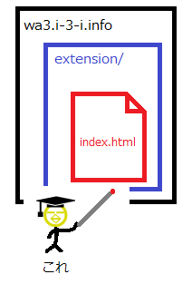
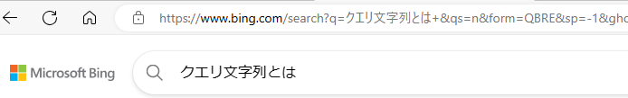
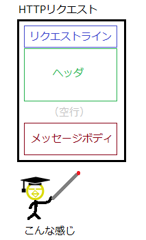
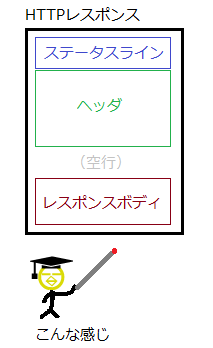

# URL
見たいホームページが「どこにあるファイルか」「どんな名前のファイルか」などを示す、**ホームページの住所**に相当する情報。  
＜URLの構成＞  
例：　`http://wa3.i-3-i.info/extension/index.html`  

**URLの詳しい構成は以下のようになる。**  
http://(スキーム名) + wa3.(ホスト名、サブドメイン名) + i-3-i.info(ドメイン名) +  :80(ポート番号) + /extension/(ファイルまでのパス)  
これらをすべてつなげると`http://wa3.i-3-i.info:80/extension/index.html` となる。  
  
これは  
「wa3.i-3-i.info」にあるコンピュータに「80」番ドアから入って行って「extension」というフォルダにある「index.html」というファイルを「HTTP」というやり方で持ってくる  
ということを意味している。  
　　
# クエリ文字
クエリ文字列はURIの構文の一つで、URIの最後の「?」の後ろにキーワードと値を記述することでクライアントからサーバーに情報を送信するもの。  

例：`http://example.com?タグ＝猫`  
上記の例は「猫」でタグ付けされているページを表示したい時のクエリ文字である。  

__また、クエリ文字は「＆」で複数指定ができる。__  
猫がタグ付けされているページの3ページ目を表示したい場合は、  
`http://example.com?タグ＝猫&page=3` となる。  
  
  
＜URLデコードとURLエンコード＞  
URLで使えるテキストは半角英数字といくつかの記号だけである。  
だが、下の画像のURLでは  
`https://www.bing.com/search?q=クエリ文字とは+&qs...`  
となっている。  
  
  
一つ疑問が生じる。なぜ半角英数字といくつかの記号しか使えないはずなのに日本語が出てくるのだろうか。  
  
**ここで「URLデコード」が出てくる。**  
  
URLデコードとは、URLで日本語を利用するために半角英数字と記号のテキストを日本語に置き換えること。  
  
置き換えるといっても表示は日本語になっているが実際のURLは  
`https://www.bing.com/search?q=%E3%82%AF%E3...`  
のように半角英数字といくつかの記号になっている。  
  
また、日本語を半角英数字と記号に置き換える事を**URLエンコード**という。　　
　　
# パス変数（パスパラメーター）  
パスパラメータとは、URLパラメータの一種として、URLのパスの中に埋め込まれた変数のようなもの。  
📝 URLパラメータ‥‥サーバーに情報を送るためにURLに付け加える変数のこと。  
  
例：　`http://example.com/users/12345`  
上記のURLの「/users/12345」の部分がパスパラメーターになる。  
ここで「12345」の部分がユーザーIDなどを表す変数になっている。  
  
＜特徴＞  
- URLパスに直接埋め込むので、読み取りが簡単  
- GETリクエストで主に利用される  
- データの取得や特定リソースの操作に利用される  
  
# クエリ文字列とパス変数の違い  
＜見た目＞  
`https://zenn.dev/search?q=Laravel`
  
パスパラメータはsearchの部分になり、 クエリパラメータは?q=Laravelの部分になる。
  
＜中身＞  
パスパラメータ‥‥特定のもの（画面など）を表示したいときに必要  
クエリパラメータ‥‥特定のもの（画面など）に条件を加える場合に必要　　
　　
# HTTPメソッド  
HTTPリクエストを用いてwebサーバーに具体的な要求をしているのはHTTPリクエスト内に含まれるHTTPメソッドである。  

| HTTPメソッド名 | 説明                                                   |  
|:---------:|------------------------------------------------------|  
|    GET    | HTMLファイルや画像といったデータを取得する際に使用される。<br>webサイト閲覧時には一番使われる |  
|   POST    | データの追加や子リソースの作成                                      |  
|    PUT    | データを更新する際に使われる                                       |  
|  DELETE   | データを更新する際に使われる                                       |  
|   PATCH   | データを更新するために使われる                                      |  
  
# リクエストヘッダ  
HTTPリクエストを構成する3つの要素の一つで、リクエストに関する追加情報やクライアント自身の情報をサーバーに伝えるためのもの。  
  
＜3つの要素＞  
1. リクエストライン  
2. リクエストヘッダ  
3. リクエストメッセージボディ  
  
  
  
# HTTPレスポンス
レスポンスメッセージは大きく分けて3種類の情報がある。
- ステータスライン
- HTTPレスポンスヘッダ
- HTTPレスポンスボディ  
  

# HTTPステータスコード  
HTTPレスポンスの**ステータスライン**の中に入っている。  
サーバからのレスポンスの意味を表す3桁の数字コードで、特定のHTTPリクエストが正常に完了したかを示している。  
＜ステータスコードは5つのクラスに分類される＞  
100番台‥‥情報レスポンス  
200番台‥‥成功レスポンス  
300番台‥‥リダイレクト  
400番台‥‥クライアントエラー   
500番台‥‥サーバエラー    
  
以下、代表的なステータスコードを抜粋。  
  
|        HTTPステータスコード        | 説明                                                   |  
|:--------------------------:|------------------------------------------------------|  
|          200(OK)           | リクエストした処理、指定したデータの取得に成功                              |  
|        201(Created)        | リクエストが成功し、リソースが作成                                    |  
|      400(Bad Request)      | 定義されていないメソッドを使ったり、パラメータに間違いがあるなど、クライアントのリクエストがおかしい場合 |  
|       404(Not Found)       | リクエストされたリソースが存在しない                                   |  
| 500(Internal Server Error) | サーバ側に何らかの異常が発生し正常なレスポンスが返せない                         |  
  
# レスポンスヘッダ　　
クライアントに対して、レスポンスのステータスコードやサーバーのバージョン、セキュリティ関連の情報など、様々な情報を提供する。  
  
ヘッダの各要素は、**フィールド名：内容**の形式で構成される。  
  
# レスポンスボディ  
HTTPリクエストメッセージの本文の部分で、クライアントがサーバーに送信したいデータを含まれている。  
**「相手が欲しがってたファイルの中身」**が書いてある場所のこと。  
  
# JSON  
「JavaScript Object Notation」の略称。  
データをやり取りする時の書き方のルールの一つ。  
＜書き方＞  
{  
"key":"value",  
"key":"value"  
}  
- JSONは {} の中にキーと値をコロンで区切って記述  
- キーは必ずダブルクォーテーションで囲む必要がある  
- カンマで区切ると、キーと値の組み合わせを複数記述できる  

(例)  
```json
{
  "dogname":"kotetu",
  "catname":"komugi"
}
```  
# 参照　　
[「わかりそう」で「わからない」でも「分かった」気になれるIT用語](https://wa3.i-3-i.info/index.html)  
[Qiita](https://qiita.com/)